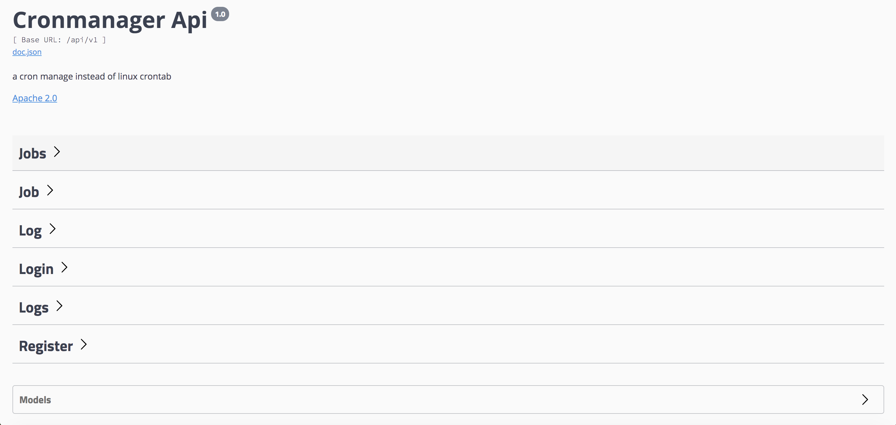

#### CronManager

##### cronManager is developed by go to manage your cron jobs instead of linux crontab

##### Features

- **cron jobs(crud)**
- **logs for cron jobs**

- **swagger apis**

##### Steps

1. `go mod tidy` .
2. Cofig your `redis` `mysql` `http server port` `log` and `JWT key` .
3. `go run main/main.go -create_table` to run the server and create tables in mysql database at first time, `go run main/main.go` just run the server.
4. Open your browser and type [http://localhost:8888/swagger/index.html](http://localhost:8888/swagger/index.html) in
5. add a cron job

##### Need kown

1. Jobs will stop if you stop the server, and jobs  will start which status is 1(1 means run, 0 means stop) when the server restart.

2. If you want to exec mutiple commands please post params below:

   ```
   {
     "command": "cd /data/test;python3 test.py", // mutiple commands split by ';'
     "name": "test1", // job name
     "spec": "*/10 * * * * *", // run every ten seconds
     "status": 1  // 1 means add the job and run, 0 means add the job but not run(only run when status is 1)
   }
   ```
3. jobs stored in redis and jobs' logs stored in mysql

4. cron jobs based on https://github.com/robfig/cron, so make sure you job spec are correct or it will return `bad request` when you add or update a cron job.Documentation here:https://godoc.org/github.com/robfig/cron

   

   
